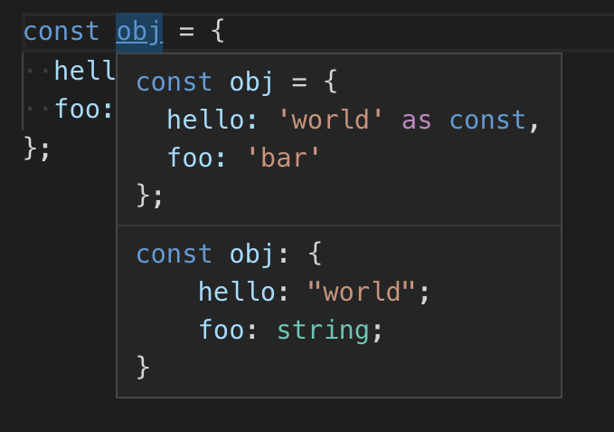

# const Assertion

```javascript
// 하나의 속성에 대한 const assertion
const obj = {
  hello: 'world' as const,
  foo: 'bar'
};

// 모든 속성에 대한 const assertion
const obj = {
  hello: 'world',
  foo: 'bar'
} as const;
```



```javascript
const circle = {
  type: 'circle',
  radius: 10
};
const square = {
  type: 'square',
  width: 10,
  height: 20
} as const;

type Shape = typeof circle | typeof square;

function draw(shape: Shape) {
  switch (shape.type) {
    case 'circle':
      console.log(shape.radius);
      break;
    case 'square':
      console.log(shape.width);
// Property 'width' does not exist on type 'Shape'.
// Property 'width' does not exist on type '{ type: string; radius: number; }'.(2339
      break;
  }
}
```

Shape의 타입은 const assertion을 적용한 square type만 리터럴 문자열 타입으로 적용되었다. 따라서, case 문에서 타입추론이 이루어지지 않고, square 타입의 width가 있어도 에러가 발생하게 된다. 

이럴 때, 두 타입 전부 const assertion를 적용한다. 

```typescript
type Shape = {
    type: string;
    radius: number;
} | {
    readonly type: "square";
    readonly width: 10;
    readonly height: 20;
}
```

